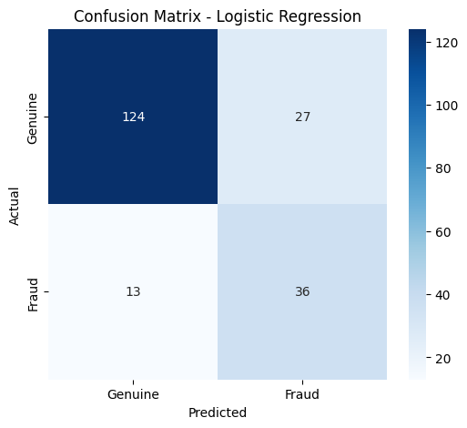

# Insurance Claim Fraud Detection

A Machine Learning classification project that predicts whether an insurance claim is genuine or fraudulent using Logistic Regression.

## Problem Statement

Insurance fraud can lead to significant financial losses for insurance companies.
This project uses historical insurance claim data to classify claims as either genuine or fraudulent.

## Objective

The objective is to build a classification model that can identify potentially fraudulent insurance claims.

## Dataset

The dataset contains information related to insurance claims, including customer, policy, incident and claim-related attributes.

The original dataset was obtained from Kaggle and was used for the analysis and model development.

Dataset Source: [Kaggle Dataset](https://docs.google.com/spreadsheets/d/1Yn6hafcUmS__a6FuF0M0G147oM0-9MDg/edit?usp=sharing&ouid=100373334853133865612&rtpof=true&sd=true)

## Technologies Used

- Python
- Pandas
- NumPy
- Matplotlib
- Seaborn
- Scikit-learn
- Google Colab

## Machine Learning Workflow

1. Data Loading
2. Data Cleaning and Preprocessing
3. Exploratory Data Analysis
4. Feature Selection
5. Train-Test Split
6. Logistic Regression
7. Model Prediction
8. Model Evaluation
9. Confusion Matrix
10. Result and Conclusion

## Data Preprocessing

The dataset was checked for:

- Missing values
- Duplicate records
- Numerical and categorical features
- Outliers

Missing numerical values were handled using the median, and categorical variables were converted into numerical form using One-Hot Encoding.

## Machine Learning Model

### Logistic Regression

Logistic Regression was used as the classification algorithm to predict whether an insurance claim is genuine or fraudulent.

## Evaluation Metrics

The model was evaluated using:

- Accuracy
- Precision
- Recall
- F1-Score
- Confusion Matrix

## Results

The Logistic Regression model achieved an accuracy of approximately 81%.

The confusion matrix and classification metrics are included in the notebook.

### Confusion Matrix

The confusion matrix shows the number of correctly and incorrectly classified genuine and fraudulent insurance claims.

## Conclusion

The project demonstrates how Machine Learning can be applied to insurance claim data to classify claims as genuine or potentially fraudulent.

## Project Files

- `insurance_claim_fraud_detection.ipynb` – Complete Python implementation and analysis.
- `confusion_matrix.png` – Confusion matrix of the Logistic Regression model.
